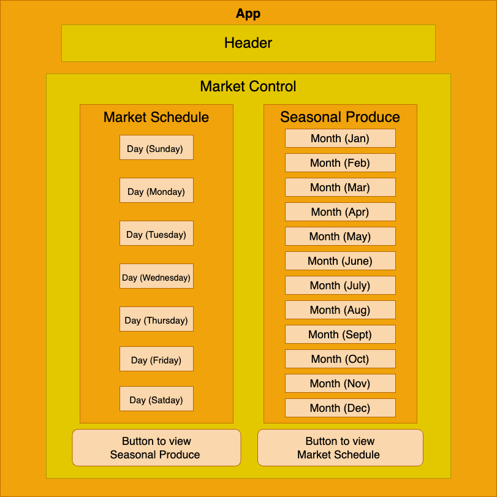

# Farmers Market

#### By: Rosie Gardner, Erika Mogollon, and Rian Carter   - Dino Co-hort

## Description
 This web application was created as a skills exercise for React Fundamentals @Epicodus, Aug '22.

 

### Technologies Used

* React
* JavaScript
* JSX
* HTML
* Git

### Setup/Installation Requirements

* Clone or download this repository onto your desktop.
* `https://github.com/rosiegardner/react-farmers-market.git`
* Navigate to top-level of directory.
* Open VScode or Text Editor of your choosing.
* In terminal run:
* `npm install`
* `npm run start`

### Known Bugs

* NO KNOWN BUGS

### Contact
* Rosie Gardner <rosiegardner78@gmail.com>
* Erika Mogollon <fany200025@hotmail.com> 
* Rian Carter <r.carter86@gmail.com>

### License

MIT

Copyright (c) Aug. 2022 